# Dynatrace internship interview task

This task was implemented using .Net on the backend and React application as the frontend.

## Startup on Windows 11:

To run this project, you need .Net 7 and Node.js (v18.16.0+) installed on your computer.

1. Download this project using `git clone https://github.com/evgenius081/dynatrace_task.git` command in terminal.
2. Open new terminal window in project parent folder.
3. In terminal type `cd Backend/BankApp.API`
4. In terminal type `dotnet run`
5. Open new terminal window in project parent folder.
6. In terminal type `cd Frontend`
7. In terminal type `npm install`
8. In terminal type `npm run build`
9. In terminal type `npm start`

**Alternatively**, you can run backend using Microsoft Visual Studio 2022 following these steps:
1. Open parent project folder
2. Open folder `Backend`
3. Open `Backend.sln` file in Visual Studio 2022 or later
4. Choose `https` launch option if not chosen
5. Run the project using button or `Ctrl+F5`

**Alternatively**, you can run the entire solution using Docker (and it should be running). To do so,
1. Open new terminal window in project parent folder.
2. In terminal type `docker-compose up`
3. Open browser and proceed to page `http://localhost:3000`

## Run examples
### Using frontend
- Task 1 
    1. proceed to `http://localhost:3000/` or `http://localhost:3000/average`
  
        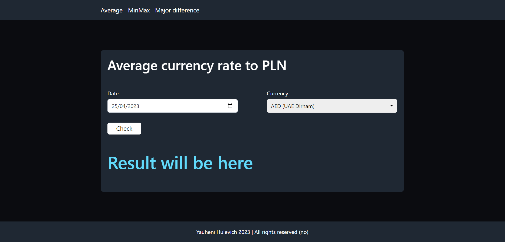

    2. choose date and currency , e.g. 21/04/2023 (depending on system and browser settings) and AUD (Australian Dollar)

        

    3. click on `Check` button

    **Expected result**:

    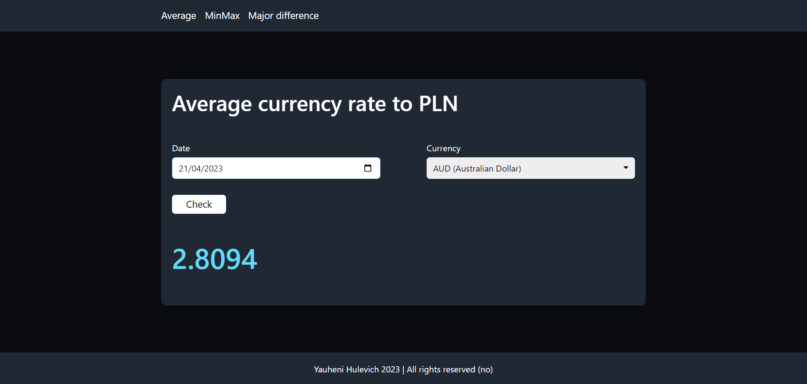

- Task 2
    1. proceed to `http://localhost:3000/minmax` 

        

    2. choose currency and quotation number, e.g. AUD (Australian Dollar) and 10

        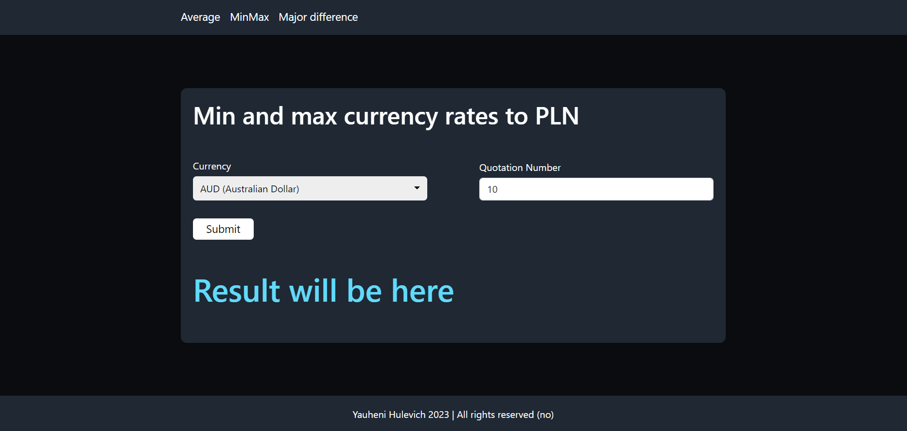

    3. click on `Check` button

    **Expected result**:

    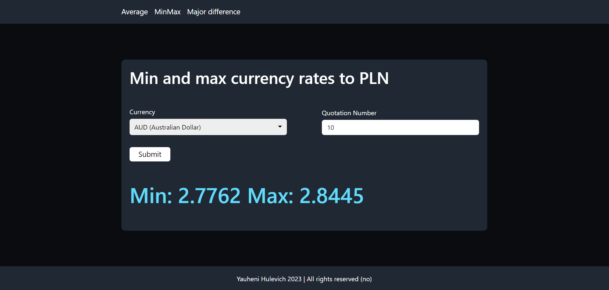

- Task 3
    1. proceed to `http://localhost:3000/major-difference` 

        
    
    2. choose currency and quotation number, e.g. AUD (Australian Dollar) and 10

        

    3. click on `Check` button

    **Expected result**:

    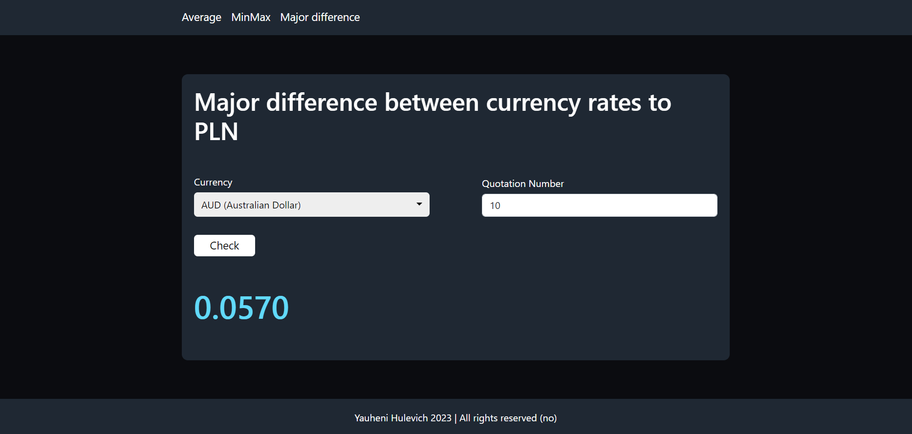

- Case when request it ok, but there is no such data in NBP API
    1. proceed to `http://localhost:3000/` or `http://localhost:3000/average`
  
        

    2. choose date, e.g. 21/04/2023 (depending on system and browser settings)

        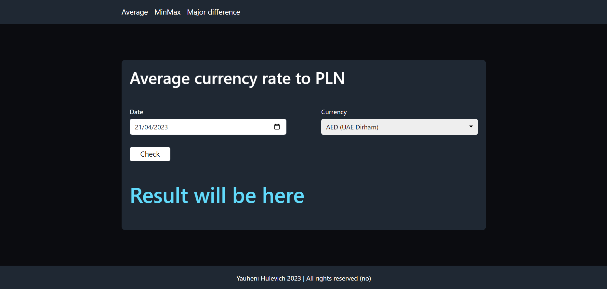

    3. click on `Check` button

    **Expected result**:

    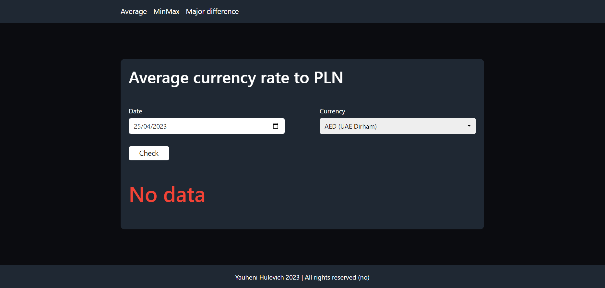

- Case when entered data is not ok, e.g. quotation number is too high
    1. proceed to `http://localhost:3000/major-difference` 

        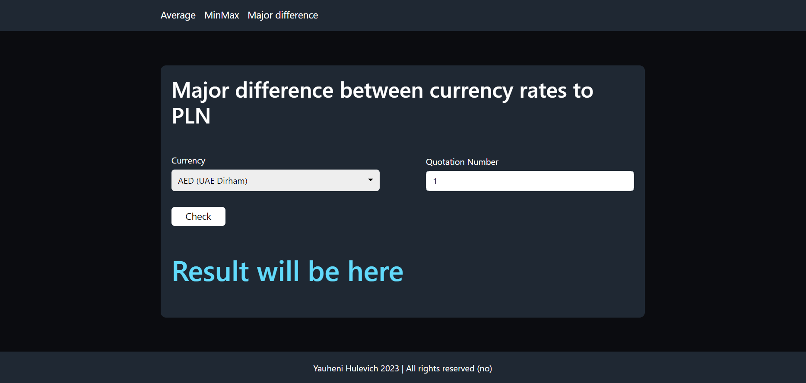
    
    2. choose quotation number higher than 255 or less then 1, e.g. 10000

        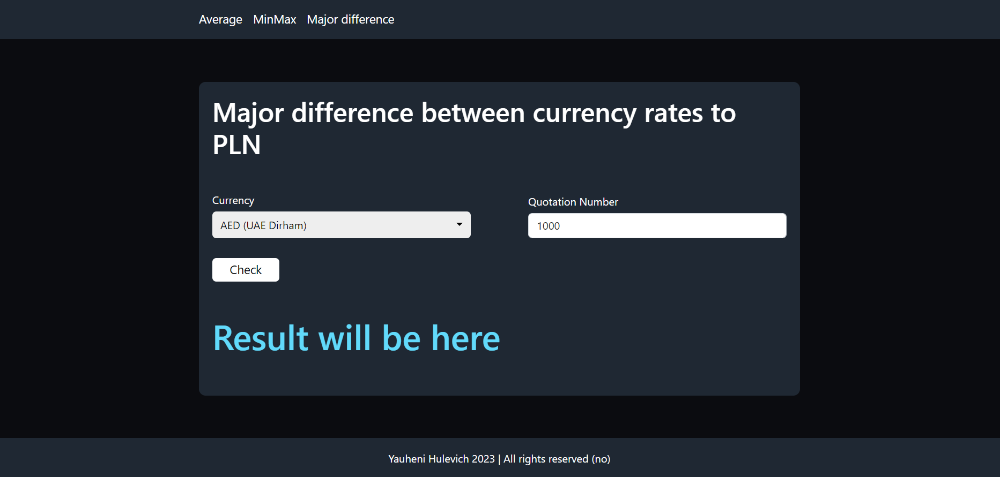

    3. click on `Check` button

    **Expected result**:

    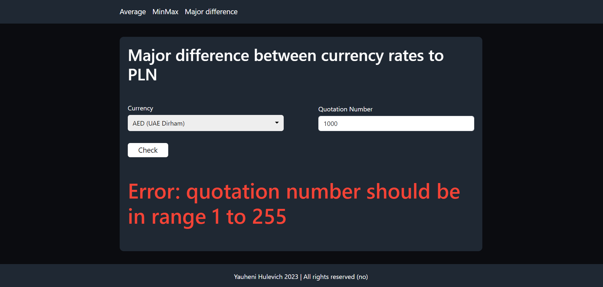

There are also pages for wrong address on the frontend (proceed to `http://localhost:3000/foo`) and internal BNP or my APIs (proceed to `http://localhost:3000/error`)

### Using Postman
Open Postman and import `Dynatrace task.postman_collection.json` file

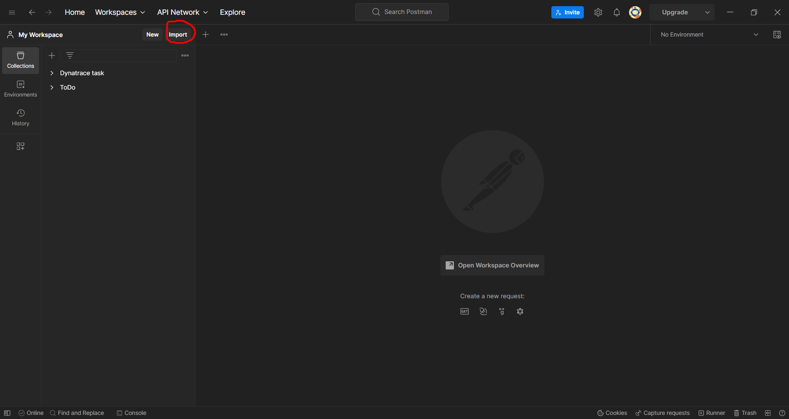
    
**Examplary test run**:

1. Choose test, click marked with green button and click `Send`

    **Note**: if you launched solution using Docker, choose tests from `Docker` folder

    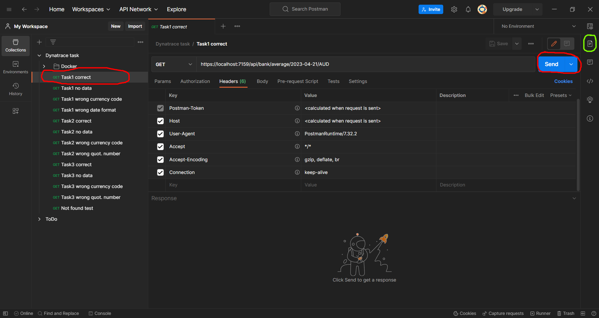

2. Here you can see the output and the expected result 

    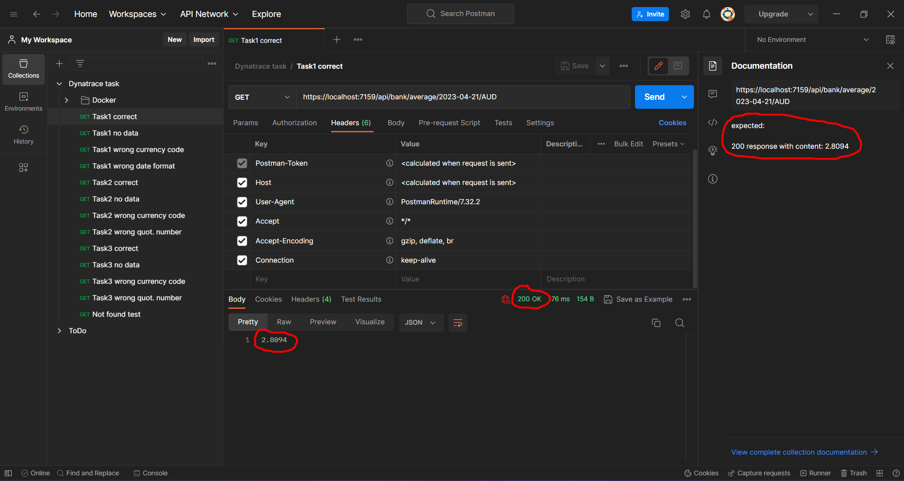

If you have any questions, feel free to contact yauheni.hulevich@gmail.com.